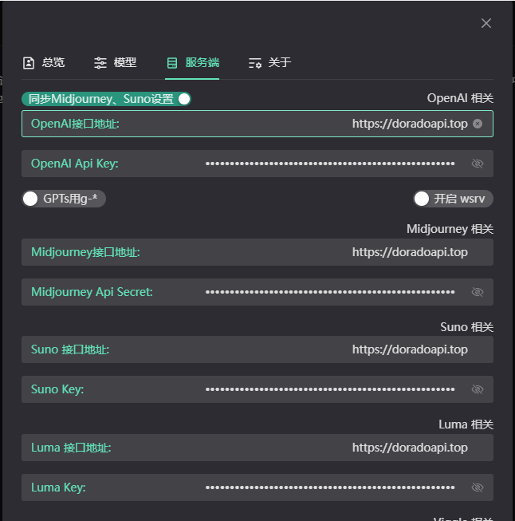

<p align="center">
  <a href="https://github.com/CK-henry/comprehensive_chatgpt_api"></a>
</p>

<div align="center">

# Dorado-CHATGPT-API

通过标准的 OpenAI格式使用ChatGPT API

</div>

<p align="center">
  
</p>


> [!NOTE]
> 使用者必须在遵循 OpenAI 的[使用条款](https://openai.com/policies/terms-of-use)以及**法律法规**的情况下使用，不得用于非法用途。
> 
> 根据[《生成式人工智能服务管理暂行办法》](http://www.cac.gov.cn/2023-07/13/c_1690898327029107.htm)的要求，请勿对中国地区公众提供一切未经备案的生成式人工智能服务。
>
> 项目应用[《剑鱼Chat》](https://www.doradochat.com/) 无需魔法

## 项目介绍

1. API平台支持：
   + [√] OpneAI
   + [√] Midjourney 绘图
   + [√] suno 文生歌
   + [√] Luma 视频
   + [√] Claude
   + [√] Moonshot(Kimi)
   + [√] Gemini
   + [√] 百度千帆（文心一言）
   + [√] 阿里千文
   + [√] 智普AI
   + [√] Deepseek
   + [√] 百川智能
   + [√] 零一万物
   + [√] 讯飞星火
   + [√] langchain
   + [√] Bing
   + [√] 360
   + [√] 腾讯混元

3. 标准的OpenAI接口请求格式。
4. 支持流式响应输出。
5. 完美兼容各类开源的GPT项目/应用/软件。


### API特点

1. 更低延迟、高性能、高可用、高并发、直连官方API（无逆向无多层中转），享受极致体验。
2. 支持OpenAI所有模型，包括（联网、绘画、聊天、训练、图片分析、GPTs等）等五六十种模型。
3. gpt4价格仅为官网价格的2-3折之间，gpt-3.5系列模型为1.4-2折之间，白菜价格。
4. 定价策略透明公开，模型扣费倍率与官网同步（甚至更低），永不暗调倍率，无低价格却又高倍率陷阱。
5. 不限时间、按量计费、明细可查，每一笔消费都公开透明。


## 常用应用支持

> [!NOTE]
> 理论上支持所有可以自定义API地址的GPT应用，以下是一些常用的应用。
>
> 所有应用的API地址（BaseUrl）为`https://doradoapi.top`

### 一、开源应用chatgpt-web-midjourney-proxy

> [开源chatgpt-web-midjourney-proxy](https://github.com/Dooy/chatgpt-web-midjourney-proxy) 二开版本，支持Midjourney,音乐，视频的开源应用。（强烈推荐）
绑定教程截图：

点击设置图标。找到自定义接口设置，配置如下：


### 二、ChatGPT.好友插件

> 该插件为utools的一个插件，支持自定义模型、一键呼出，即用既走，超级面板，在pc任意位置均可快速发送消息。支持Ai聊天、绘画、语音对话、多api管理、多key绑定、角色独立聊天记录、一键查余额。桌面端的神器，但不支持移动端。
>
> 是一个功能非常全面的ai聊天应用插件。
> 
> [ **查看应用**](https://u.tools/plugins/detail/ChatGPT.%E5%A5%BD%E5%8F%8B/)

绑定教程截图：

绑定方法类似上方截图教程，填写API地址`https://doradoapi.top`+`apikey` 即可。

### 三、开源应用Chatgpt-next-web（ChatGPT-Midjourney）

> [开源Chatgpt-next-web](https://github.com/ChatGPTNextWeb/ChatGPT-Next-Web) 这是一个开源web聊天工具，只支持聊天。
> 
> [开源ChatGPT-Midjourney](https://github.com/Licoy/ChatGPT-Midjourney) 二开版本，支持Midjourney对话的开源应用。
> 


点击设置图标。找到自定义接口设置，
绑定方法类似上方截图教程，填写API地址`https://doradoapi.top`+`apikey` 即可。

### 四、Lobe-chat

> [Lobe-chat](https://github.com/lobehub/lobe-chat) 是一个开源的聊天应用，支持聊天、绘画、语音对话等。

绑定方法类似上方截图教程，填写API地址`https://doradoapi.top`+`apikey` 即可。

### 五、BotGem

> [BotGem](https://botgem.com/) 非开源工具，支持PC和移动端，功能单一，只支持聊天，但多端适配。

绑定方法类似上方截图教程，填写API地址`https://doradoapi.top`+`apikey` 即可。

### 六、ChatBox

> [ChatBox](https://github.com/Bin-Huang/chatbox) 支持桌面端APP版和web版，点开setting按钮配置即可。

绑定方法类似上方截图教程，填写API地址`https://doradoapi.top`+`apikey` 即可。

### 七、FastGPT

> [FastGPT](https://github.com/labring/FastGPT) 支持知识库的聊天应用。

部署时参数host填写`https://doradoapi.top` 可以传入我们的`apikey` 即可

### 更多应用支持

待更新...

### OpenAi官方python库

> 在openai官方库开发时传入baseurl和apikey即可。
>
> [openai-python](https://github.com/openai/openai-python)

以官网的`python`库为例：注意，需要传入`/v1/`后缀。并且openai库需升级到最新版，老版本传参格式不一样，具体参考官方py库文档。

```python
import os
import openai

# optional; defaults to `os.environ['OPENAI_API_KEY']`
openai.api_key = "您的APIKEY"

# all client options can be configured just like the `OpenAI` instantiation counterpart
openai.base_url = "https://doradoapi.top/v1/"
openai.default_headers = {"x-foo": "true"}

completion = openai.chat.completions.create(
    model="gpt-3.5-turbo",
    messages=[
        {
            "role": "user",
            "content": "Hello world!",
        },
    ],
)
print(completion.choices[0].message.content)

# 正常会输出结果：Hello there! How can I assist you today ?
```

### OpenAi官方node库

> [openai-node](https://github.com/openai/openai-node)

以官网的`node`库为例：注意，需要传入/v1后缀。

```js
const { Configuration, OpenAIApi } = require("openai");

const configuration = new Configuration({
  apiKey: "您的apikey",
  basePath: "https://doradoapi.top/v1"
});
const openai = new OpenAIApi(configuration);

const chatCompletion = await openai.createChatCompletion({
  model: "gpt-3.5-turbo",
  messages: [{role: "user", content: "Hello world"}],
});

console.log(chatCompletion.data.choices[0].message.content);
```
